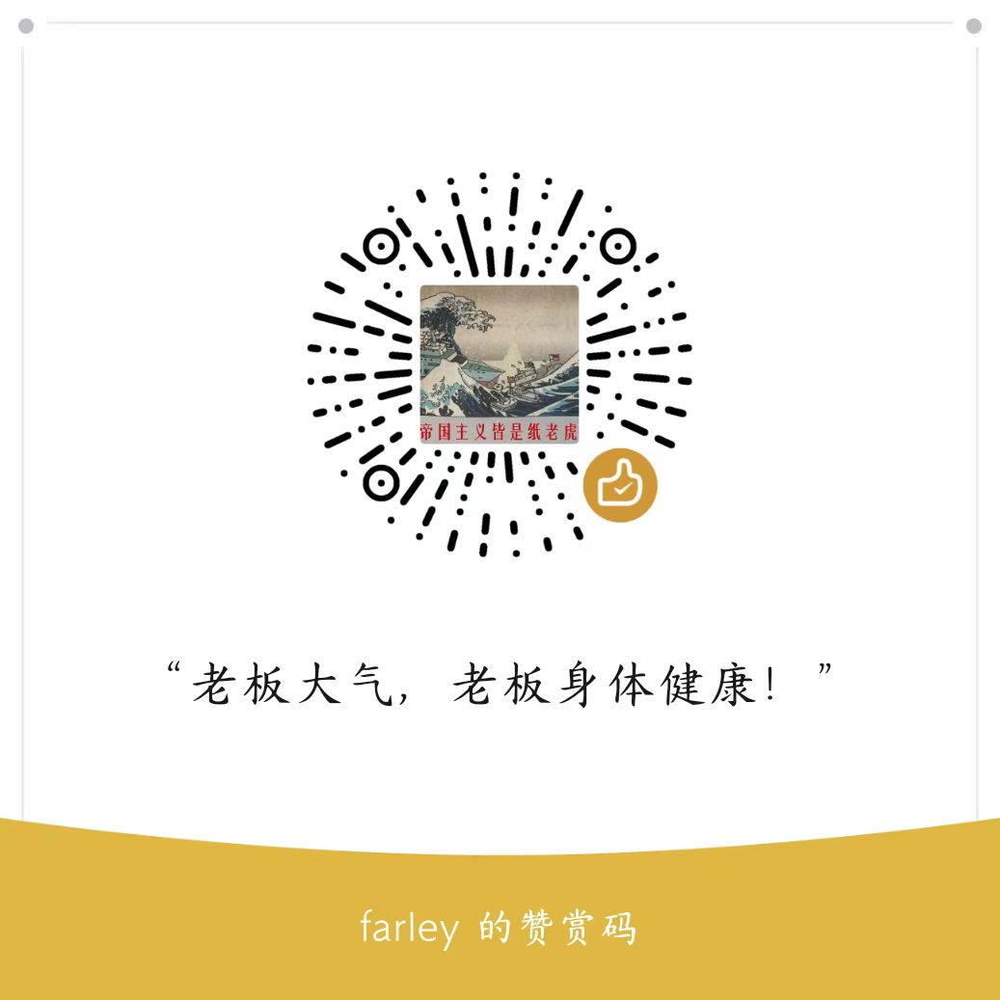

# CTI-TI-book
情报学、网络威胁情报技术书籍

- 情报学
    - 待整理

- 网空威胁情报
    - 技术类别
    - 市场类别

- 认知安全
    - 待整理
    
- 美军行动指南
    - 美国陆军
    - 美国空军

## 关于我们

赤旗情报团队目前有3位同学共同创作与运营，共同以网络空间威胁情报为核心进行理论和实践的研究。

微信公众号：赤旗情报站

博客：3dline.xyz

